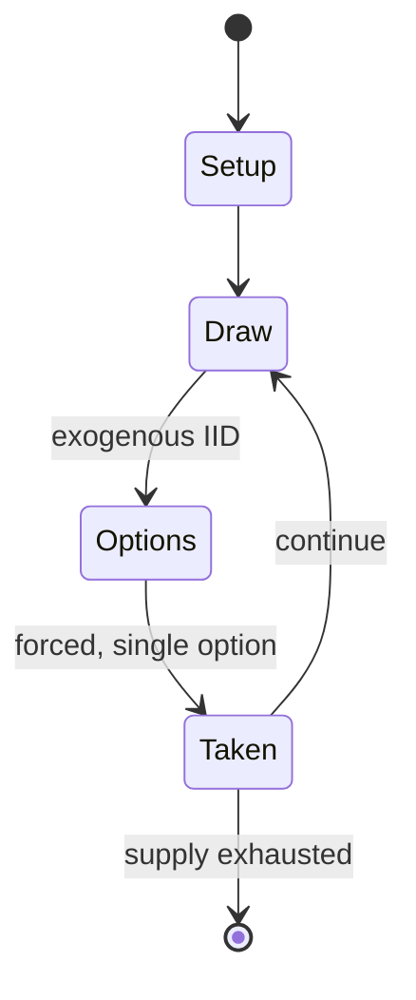

# Yut

`yut` &nbsp; state: **DEEPENED** &nbsp; method: **heuristic**

## Found layer (recorded, not trusted)

| field | value |
| --- | --- |
| wikidata | -- |
| wikipedia | Yut |
| genres (source) | -- |
| instance of (source) | -- |
| country of origin | -- |

## Declared layer (orders bench work)

| field | value |
| --- | --- |
| year created | -- |
| epoch | -- |
| region | -- |
| media | BOARD, DICE |
| players | -- |
| age band | -- |
| exogenous process | IID |
| loss shape | -- |
| live axes | - |
| horizon | -- |
| scoring shape | -- |
| information | -- |
| interaction | COMPETITIVE |
| turn structure | STRICT_TURN |
| tractability | EXACT_WITH_CUT |
| randomness | DICE |
| luck factor | 0.58 |
| rules complexity | 2.23 |
| strategic depth | 1.87 |
| novelty | 0.6513 |
| solved status | -- |
| strategies | -- |
| algorithms | -- |

## Object model

```
Episode
  players      : ?
  turn_structure: STRICT_TURN
  horizon       : ?
  scoring       : ?

Board          -- spatial substrate; cells carry position and occupancy
Piece          -- movable token owned by a player
DicePool       -- n dice, each an iid categorical draw
Roll           -- realised outcome of a pool
```

## State transition diagram



## Research item -- turn trace

```
# Yut -- simulated turn events
# generated from the DECLARED vector, not from a rulebook.
# structure: exo=IID loss=None horizon=None scoring=None axes=-

t=0    SETUP        players=2  pot=0  capacity=3
t=1    DRAW         p1 roll from d6 pool -> outcome #4  (p=0.048)
t=2    FORCED       p1 single legal option taken (pot_gain=+1.1)
t=3    DRAW         p1 roll from d6 pool -> outcome #3  (p=0.030)
t=4    FORCED       p1 single legal option taken (pot_gain=+1.5)
t=5    DRAW         p1 roll from d6 pool -> outcome #2  (p=0.054)
t=6    FORCED       p1 single legal option taken (pot_gain=+1.0)
t=7    DRAW         p1 roll from d6 pool -> outcome #5  (p=0.188)
t=8    FORCED       p1 single legal option taken (pot_gain=+0.6)
t=9    DRAW         p1 roll from d6 pool -> outcome #1  (p=0.162)
t=10   FORCED       p1 single legal option taken (pot_gain=+1.9)
t=11   ENDTURN      turn passes to p2
t=12   DRAW         p2 roll from d6 pool -> outcome #6  (p=0.100)
t=13   FORCED       p2 single legal option taken (pot_gain=+1.0)
t=14   DRAW         p2 roll from d6 pool -> outcome #4  (p=0.061)
t=15   FORCED       p2 single legal option taken (pot_gain=+1.1)
t=16   DRAW         p2 roll from d6 pool -> outcome #3  (p=0.238)
t=17   FORCED       p2 single legal option taken (pot_gain=+1.0)
t=18   DRAW         p2 roll from d6 pool -> outcome #2  (p=0.279)
t=19   FORCED       p2 single legal option taken (pot_gain=+0.9)
t=20   DRAW         p2 roll from d6 pool -> outcome #4  (p=0.194)
t=21   FORCED       p2 single legal option taken (pot_gain=+0.6)
t=22   ENDTURN      turn passes to p1
t=23   DRAW         p1 roll from d6 pool -> outcome #6  (p=0.142)
t=24   FORCED       p1 single legal option taken (pot_gain=+1.6)
t=25   DRAW         p1 roll from d6 pool -> outcome #6  (p=0.060)
t=26   FORCED       p1 single legal option taken (pot_gain=+1.9)

terminal: VARIABLE
```

## Source extract

Yunnori  (Korean: 윷놀이), also known as yutnori, yut, nyout and yoot, is a traditional board game
played in Korea, especially during Korean New Year. The game is also called cheoksa (척사; 擲柶) or
sahui (사희; 柶戲).   == Origin ==  Yunnori finds its roots in Korea's Three Kingdom Period (57 BCE
– 668 CE). While its exact origin remains uncertain, evidence of yunnori has been documented in
various historical records spanning Korea, China, and Japan. A claim by Korean historian and
activist Chae Ho-shin suggests its descent from the Korean Kingdom Gojoseon in 2333 BC, as
mentioned in a book by Buddhist monk Ilyeon (Park et al., 2013). Petroglyphs bearing records of
yunnori during the Joseon era were discovered in the mountains of the Korean Peninsula and
Manchuria. Surprisingly, yut carvings were also found in a Buddhist temple and were most likely
designated prayer sites. Historians draw connections between yunnori and a Chinese chess game
called chupu/jeopo from the 1400s to 1860s, highlighting similarities in their four-token
systems. Notably, Goryeo-era documents illustrated yut boards and their 29 stations. Yunnori's
presence is also depicted in traditional Korean paintings (minhwa).

<sub>Wikipedia, CC BY-SA. Retained as evidence for the structural
classification above. Every rule inferred from it is HYPOTHESIZED
until audited against a rulebook.</sub>
