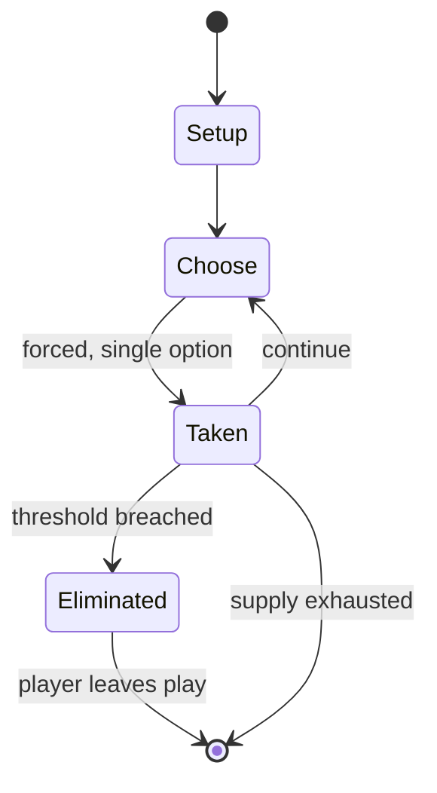

# Zip

*party-game*

`zip` &nbsp; state: **DEEPENED** &nbsp; method: **heuristic**

## Found layer (recorded, not trusted)

| field | value |
| --- | --- |
| wikidata | Q265142 |
| wikipedia | Zip (game) |
| genres (source) | -- |
| instance of (source) | party game, warming up |
| country of origin | -- |

## Declared layer (orders bench work)

| field | value |
| --- | --- |
| year created | -- |
| epoch | -- |
| region | -- |
| media | PARTY |
| players | -- |
| age band | -- |
| exogenous process | -- |
| loss shape | ELIMINATION |
| live axes | SPATIAL |
| horizon | VARIABLE |
| scoring shape | SET_COLLECTION_CONVEX |
| information | -- |
| interaction | SOLITAIRE |
| turn structure | STRICT_TURN |
| tractability | SAMPLING_ONLY |
| randomness | -- |
| luck factor | 0.35 |
| rules complexity | 2.04 |
| strategic depth | 2.25 |
| novelty | 0.6632 |
| solved status | -- |
| strategies | set_collection |
| algorithms | -- |

## Object model

```
Episode
  players      : ?
  turn_structure: STRICT_TURN
  horizon       : VARIABLE
  scoring       : SET_COLLECTION_CONVEX

Placement      -- position subject to geometric legality
```

## State transition diagram



## Research item -- turn trace

```
# Zip -- simulated turn events
# generated from the DECLARED vector, not from a rulebook.
# structure: exo=None loss=ELIMINATION horizon=VARIABLE scoring=SET_COLLECTION_CONVEX axes=SPATIAL

t=0    SETUP        players=2  pot=0  capacity=3
t=1    FORCED       p1 single legal option taken (pot_gain=+1.7)
t=2    SPATIAL      p1 places at (1,5); adjacency legal
t=3    FORCED       p1 single legal option taken (pot_gain=+1.9)
t=4    FORCED       p1 single legal option taken (pot_gain=+1.2)
t=5    SPATIAL      p1 places at (5,5); adjacency legal
t=6    FORCED       p1 single legal option taken (pot_gain=+2.0)
t=7    FORCED       p1 single legal option taken (pot_gain=+1.7)
t=8    SPATIAL      p1 places at (0,6); adjacency legal
t=9    FORCED       p1 single legal option taken (pot_gain=+1.7)
t=10   FORCED       p1 single legal option taken (pot_gain=+0.8)
t=11   SPATIAL      p1 places at (4,5); adjacency legal
t=12   FORCED       p1 single legal option taken (pot_gain=+1.4)
t=13   FORCED       p1 single legal option taken (pot_gain=+1.3)
t=14   FORCED       p1 single legal option taken (pot_gain=+1.8)
t=15   FORCED       p1 single legal option taken (pot_gain=+0.9)
t=16   FORCED       p1 single legal option taken (pot_gain=+1.5)
t=17   FORCED       p1 single legal option taken (pot_gain=+1.6)
t=18   FORCED       p1 single legal option taken (pot_gain=+1.0)
t=19   FORCED       p1 single legal option taken (pot_gain=+0.5)
t=20   SPATIAL      p1 places at (2,5); adjacency legal
t=21   ENDTURN      turn passes to p2
t=22   FORCED       p2 single legal option taken (pot_gain=+1.5)
t=23   FORCED       p2 single legal option taken (pot_gain=+1.7)
t=24   SPATIAL      p2 places at (3,5); adjacency legal
t=25   FORCED       p2 single legal option taken (pot_gain=+1.5)
t=26   FORCED       p2 single legal option taken (pot_gain=+1.0)
t=27   ENDTURN      turn passes to p1

terminal: VARIABLE
```

## Conditions

| kind | threshold | effect | trigger |
| --- | --- | --- | --- |
| TERMINATE | 2 players | -- | The game ends when there are only two players left. |
| ELIMINATE | -- | -- | Zip, sometimes known as zip zap boing or zip zap zop, is a game often used as a theatre preparation exercise and sometimes as an elimination game. |
| ELIMINATE | -- | -- | When used as an elimination game, often the last three remaining are usually considered the winners of the game. |
| ELIMINATE | -- | eliminated | Players who make a mistake are eliminated. |

## Source extract

Zip, sometimes known as zip zap boing or zip zap zop, is a game often used as a theatre
preparation exercise and sometimes as an elimination game. The game structure is folkloric and
has differing rules and names in different places. When used as an elimination game, often the
last three remaining are usually considered the winners of the game.   == Rules == The rules of
this game have many variations. The most basic form of the game involves a circle of people
sending a "clap" or "impulse" or "ball of energy" to each other in turn, saying the word "zip"
each time. Other moves such as "zap" send the clap in different directions. Although almost
every practitioner of the game uses a different set of rules, for illustrative purposes, below
are the set of rules used by the UK Scout Association:  Players stand in a circle, roughly two
metres apart. Play is passed from one player to another by use of the actions "zip", "zap", and
"boing": Zip: A player clasps their hands with thumbs raised and index fingers pointing to an
adjacent person in the circle and says "zip"; play passes to that person. Zap: A player clasps
their hands as in Zip, but pointing to any non-adjacent person in the ci

<sub>Wikipedia, CC BY-SA. Retained as evidence for the structural
classification above. Every rule inferred from it is HYPOTHESIZED
until audited against a rulebook.</sub>
