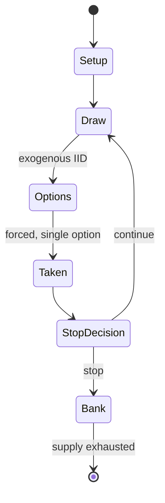

# Zombie Dice

`zombie_dice` &nbsp; state: **DEEPENED** &nbsp; method: **heuristic**

## Found layer (recorded, not trusted)

| field | value |
| --- | --- |
| wikidata | Q8073744 |
| wikipedia | Zombie Dice |
| genres (source) | -- |
| instance of (source) | -- |
| country of origin | -- |

## Declared layer (orders bench work)

| field | value |
| --- | --- |
| year created | 2010 |
| epoch | CONTEMPORARY |
| region | -- |
| media | DICE |
| players | -- |
| age band | -- |
| exogenous process | IID |
| loss shape | -- |
| live axes | STOP |
| horizon | -- |
| scoring shape | LINEAR_ACCUMULATION |
| information | -- |
| interaction | -- |
| turn structure | -- |
| tractability | EXACT_WITH_CUT |
| randomness | DICE |
| luck factor | 0.58 |
| rules complexity | 2.03 |
| strategic depth | 2.12 |
| novelty | 0.7254 |
| solved status | -- |
| strategies | push_your_luck |
| algorithms | -- |

## Object model

```
Episode
  players      : ?
  turn_structure: ?
  horizon       : ?
  scoring       : LINEAR_ACCUMULATION

DicePool       -- n dice, each an iid categorical draw
Roll           -- realised outcome of a pool
Pot            -- value accumulated this episode and at risk until banked
```

## State transition diagram



## Research item -- turn trace

```
# Zombie Dice -- simulated turn events
# generated from the DECLARED vector, not from a rulebook.
# structure: exo=IID loss=None horizon=None scoring=LINEAR_ACCUMULATION axes=STOP

t=0    SETUP        players=2  pot=0  capacity=5
t=1    DRAW         p1 roll from d6 pool -> outcome #6  (p=0.140)
t=2    FORCED       p1 single legal option taken (pot_gain=+1.6)
t=3    STOP?        p1 pot=1.6  P(bust|continue)=0.27  E[gain]=1.74 -> CONTINUE
t=4    DRAW         p1 roll from d6 pool -> outcome #2  (p=0.262)
t=5    FORCED       p1 single legal option taken (pot_gain=+1.7)
t=6    STOP?        p1 pot=3.3  P(bust|continue)=0.38  E[gain]=0.70 -> BANK
t=7    BANK         p1 banks 3.3  (pot now safe)
t=8    DRAW         p2 roll from d6 pool -> outcome #3  (p=0.206)
t=9    FORCED       p2 single legal option taken (pot_gain=+1.0)
t=10   STOP?        p2 pot=1.0  P(bust|continue)=0.26  E[gain]=1.90 -> CONTINUE
t=11   DRAW         p2 roll from d6 pool -> outcome #1  (p=0.097)
t=12   FORCED       p2 single legal option taken (pot_gain=+0.6)
t=13   STOP?        p2 pot=1.6  P(bust|continue)=0.37  E[gain]=1.57 -> CONTINUE
t=14   DRAW         p2 roll from d6 pool -> outcome #3  (p=0.011)
t=15   FORCED       p2 single legal option taken (pot_gain=+1.1)
t=16   STOP?        p2 pot=2.7  P(bust|continue)=0.50  E[gain]=1.88 -> CONTINUE
t=17   DRAW         p2 roll from d6 pool -> outcome #1  (p=0.265)
t=18   FORCED       p2 single legal option taken (pot_gain=+0.8)
t=19   STOP?        p2 pot=3.5  P(bust|continue)=0.57  E[gain]=0.70 -> BANK
t=20   BANK         p2 banks 3.5  (pot now safe)
t=21   DRAW         p1 roll from d6 pool -> outcome #6  (p=0.177)
t=22   FORCED       p1 single legal option taken (pot_gain=+0.7)
t=23   STOP?        p1 pot=0.7  P(bust|continue)=0.27  E[gain]=1.52 -> CONTINUE
t=24   DRAW         p1 roll from d6 pool -> outcome #1  (p=0.276)
t=25   FORCED       p1 single legal option taken (pot_gain=+1.3)
t=26   STOP?        p1 pot=2.0  P(bust|continue)=0.37  E[gain]=1.39 -> CONTINUE

terminal: VARIABLE
```

## Conditions

| kind | threshold | effect | trigger |
| --- | --- | --- | --- |
| BOUNDARY | -- | -- | A winner is determined if a player rolls 13 brains and all other players have taken at least one more turn without reaching 13 brains. |

## Source extract

Zombie Dice is a "press your luck" party dice game created by Steve Jackson Games and released
in 2010. A digital app version of the game has also been released.   == Gameplay == The gameplay
of Zombie Dice is simple. The player has to shake a cup containing 13 dice and randomly select 3
of them without looking into the cup and then roll them. The faces of each die represent brains,
shotgun blasts or "runners" with different colours containing a different distribution of faces
(the 6 green dice have 3 brains, 1 shotgun and 2 runners, the 4 yellow dice have 2 of each and
the 3 red dice have 1 brain, 3 shotguns and 2 runners). The object of the game is to roll 13
brains. If a player rolls 3 shotgun blasts their turn ends and they lose the brains they have
accumulated so far that turn. It is possible for a player to roll 3 blasts in a single roll, but
if only one or two blasts have been rolled the player will have to decide whether it is worth it
to risk rolling again or "bank" the brains acquired so far and pass play to the next player. A
"runner" is represented by feet and rolling a runner means that the player can roll that same
dice if they choose to press their luck. A winner is

<sub>Wikipedia, CC BY-SA. Retained as evidence for the structural
classification above. Every rule inferred from it is HYPOTHESIZED
until audited against a rulebook.</sub>
