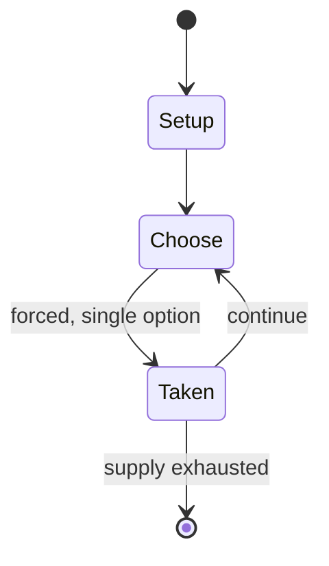

# Zoo Tycoon

*2001 video game*

`zoo_tycoon` &nbsp; state: **DEEPENED** &nbsp; method: **heuristic**

## Found layer (recorded, not trusted)

| field | value |
| --- | --- |
| wikidata | Q220102 |
| wikipedia | Zoo Tycoon (2001 video game) |
| genres (source) | business simulation game |
| instance of (source) | video game |
| country of origin | United States |

## Declared layer (orders bench work)

| field | value |
| --- | --- |
| year created | 2005 |
| epoch | CONTEMPORARY |
| region | NORTH_AMERICA |
| media | VIDEO |
| players | -- |
| age band | -- |
| exogenous process | -- |
| loss shape | -- |
| live axes | - |
| horizon | -- |
| scoring shape | SET_COLLECTION_CONVEX |
| information | -- |
| interaction | -- |
| turn structure | -- |
| tractability | SAMPLING_ONLY |
| randomness | -- |
| luck factor | 0.35 |
| rules complexity | 2.26 |
| strategic depth | 2.5 |
| novelty | 0.4137 |
| solved status | -- |
| strategies | set_collection, spatial_packing |
| algorithms | -- |

## Object model

```
Episode
  players      : ?
  turn_structure: ?
  horizon       : ?
  scoring       : SET_COLLECTION_CONVEX

WorldState     -- simulation state advanced by the engine
Avatar         -- player-controlled agent
Clock          -- frame or tick counter
```

## State transition diagram



## Research item -- turn trace

```
# Zoo Tycoon -- simulated turn events
# generated from the DECLARED vector, not from a rulebook.
# structure: exo=None loss=None horizon=None scoring=SET_COLLECTION_CONVEX axes=-

t=0    SETUP        players=2  pot=0  capacity=4
t=1    FORCED       p1 single legal option taken (pot_gain=+1.4)
t=2    FORCED       p1 single legal option taken (pot_gain=+1.0)
t=3    FORCED       p1 single legal option taken (pot_gain=+1.4)
t=4    ENDTURN      turn passes to p2
t=5    FORCED       p2 single legal option taken (pot_gain=+0.6)
t=6    FORCED       p2 single legal option taken (pot_gain=+0.8)
t=7    FORCED       p2 single legal option taken (pot_gain=+1.3)
t=8    FORCED       p2 single legal option taken (pot_gain=+1.9)
t=9    FORCED       p2 single legal option taken (pot_gain=+0.5)
t=10   FORCED       p2 single legal option taken (pot_gain=+1.0)
t=11   FORCED       p2 single legal option taken (pot_gain=+1.9)
t=12   FORCED       p2 single legal option taken (pot_gain=+1.5)
t=13   ENDTURN      turn passes to p1
t=14   FORCED       p1 single legal option taken (pot_gain=+0.9)
t=15   FORCED       p1 single legal option taken (pot_gain=+1.6)
t=16   FORCED       p1 single legal option taken (pot_gain=+1.6)
t=17   FORCED       p1 single legal option taken (pot_gain=+1.2)
t=18   FORCED       p1 single legal option taken (pot_gain=+0.8)
t=19   FORCED       p1 single legal option taken (pot_gain=+0.7)
t=20   FORCED       p1 single legal option taken (pot_gain=+0.9)
t=21   FORCED       p1 single legal option taken (pot_gain=+1.5)
t=22   FORCED       p1 single legal option taken (pot_gain=+1.9)
t=23   FORCED       p1 single legal option taken (pot_gain=+1.8)
t=24   FORCED       p1 single legal option taken (pot_gain=+1.0)
t=25   ENDTURN      turn passes to p2
t=26   FORCED       p2 single legal option taken (pot_gain=+1.4)
t=27   ENDTURN      turn passes to p1

terminal: VARIABLE
```

## Conditions

| kind | threshold | effect | trigger |
| --- | --- | --- | --- |
| BOUNDARY | -- | -- | Zoo Tycoon also received a "Gold" sales award from the Entertainment and Leisure Software Publishers Association (ELSPA), indicating sales of at least 200,000 copies in the United Kingdom; and a "Gold" certification from |

## Source extract

Zoo Tycoon is a business simulation game developed by Blue Fang Games and released by Microsoft
for Microsoft Windows and Macintosh in 2001. A version for the Nintendo DS was released in 2005,
as Zoo Tycoon DS. It was followed by two expansion packs, Dinosaur Digs and Marine Mania, which
were released in 2002, as well as a sequel, Zoo Tycoon 2, released in 2004.   == Gameplay ==
The goal of Zoo Tycoon is to create a thriving zoo by building exhibits to accommodate animals
and keeping the guests and animals happy. Exhibit-building is one of the primary goals of Zoo
Tycoon. To keep the guests and animals happy, exhibits  should be suitable to the animal; for
example, a lion is best suited to a savannah environment. Choices in terrain, foliage, rocks,
shelters, fences, toys and the presence of zookeepers all contribute to the suitability of an
exhibit and the happiness of the animal. Guest happiness is dependent on animal choice, animal
happiness, buildings, and scenery. Buildings include attractions, bathrooms, restaurants and
food stands, gift shops, animal houses, such as insect houses, primate houses, reptile houses,
nocturnal houses and aviaries, plant houses, petting zoos, and

<sub>Wikipedia, CC BY-SA. Retained as evidence for the structural
classification above. Every rule inferred from it is HYPOTHESIZED
until audited against a rulebook.</sub>
