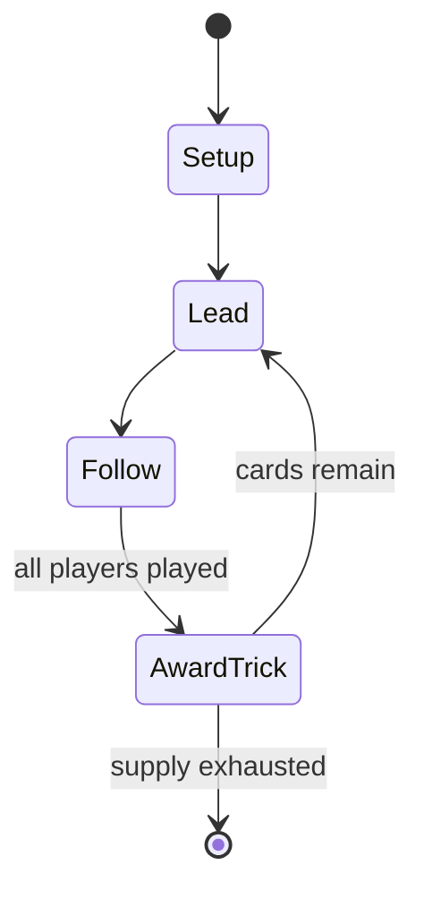

# Zwicken

*card game*

`zwicken` &nbsp; state: **DEEPENED** &nbsp; method: **heuristic**

## Found layer (recorded, not trusted)

| field | value |
| --- | --- |
| wikidata | Q244559 |
| wikipedia | Zwicken |
| genres (source) | -- |
| instance of (source) | card game, trick-taking game |
| country of origin | -- |

## Declared layer (orders bench work)

| field | value |
| --- | --- |
| year created | -- |
| epoch | -- |
| region | -- |
| media | CARD, TRICK_TAKING |
| players | 4-6 |
| age band | -- |
| exogenous process | DEPLETING_DECK |
| loss shape | -- |
| live axes | TRADE |
| horizon | -- |
| scoring shape | -- |
| information | -- |
| interaction | -- |
| turn structure | TRICK_ROUND |
| tractability | SAMPLING_ONLY |
| randomness | DECK_SHUFFLE |
| luck factor | 0.35 |
| rules complexity | 2.08 |
| strategic depth | 2.5 |
| novelty | 0.4732 |
| solved status | -- |
| strategies | opponent_modelling, spatial_packing |
| algorithms | -- |

## Object model

```
Episode
  players      : 4-6
  turn_structure: TRICK_ROUND
  horizon       : ?
  scoring       : ?

Deck           -- ordered multiset, drawn without replacement
Hand           -- private multiset held by one player
DiscardPile    -- public accumulation of spent cards
Trick          -- one card per player; a winner is determined
Trump          -- suit that dominates the ordering
Offer          -- proposed exchange between two agents
```

## State transition diagram



## Research item -- turn trace

```
# Zwicken -- simulated turn events
# generated from the DECLARED vector, not from a rulebook.
# structure: exo=DEPLETING_DECK loss=None horizon=None scoring=None axes=TRADE

t=0    SETUP        players=4  pot=0  capacity=6
t=1    DRAW         p1 draw from deck -> outcome #2  (p=0.218)
t=2    FORCED       p1 single legal option taken (pot_gain=+1.5)
t=3    ENDTURN      turn passes to p2
t=4    DRAW         p2 draw from deck -> outcome #1  (p=0.019)
t=5    FORCED       p2 single legal option taken (pot_gain=+1.5)
t=6    ENDTURN      turn passes to p3
t=7    DRAW         p3 draw from deck -> outcome #3  (p=0.209)
t=8    FORCED       p3 single legal option taken (pot_gain=+0.6)
t=9    TRADE        p3 offers 2:1 exchange to p4
t=10   ENDTURN      turn passes to p4
t=11   DRAW         p4 draw from deck -> outcome #6  (p=0.173)
t=12   FORCED       p4 single legal option taken (pot_gain=+0.8)
t=13   DRAW         p4 draw from deck -> outcome #4  (p=0.221)
t=14   FORCED       p4 single legal option taken (pot_gain=+1.0)
t=15   TRADE        p4 offers 2:1 exchange to p1
t=16   DRAW         p4 draw from deck -> outcome #3  (p=0.054)
t=17   FORCED       p4 single legal option taken (pot_gain=+0.6)
t=18   TRADE        p4 offers 2:1 exchange to p1
t=19   DRAW         p4 draw from deck -> outcome #5  (p=0.126)
t=20   FORCED       p4 single legal option taken (pot_gain=+1.9)
t=21   DRAW         p4 draw from deck -> outcome #2  (p=0.008)
t=22   FORCED       p4 single legal option taken (pot_gain=+0.6)
t=23   DRAW         p4 draw from deck -> outcome #4  (p=0.292)
t=24   FORCED       p4 single legal option taken (pot_gain=+1.0)
t=25   DRAW         p4 draw from deck -> outcome #5  (p=0.290)
t=26   FORCED       p4 single legal option taken (pot_gain=+0.7)
t=27   TRADE        p4 offers 2:1 exchange to p1

terminal: VARIABLE
```

## Source extract

Zwicken is an old Austrian and German card game for 4 to 6 players, which is usually played for
small stakes and makes a good party game. It is one of the Rams group of card games
characterised by allowing players to drop out of the current game if they think they will be
unable to win any tricks or a minimum number of tricks. Despite a lack of sources, it was "one
of the most popular card games played from the 18th to the 20th century in those regions of what
is today Austria."   == History == Zwicken is an old game. Unknown in the 1760s, it is first
recorded in Austria in 1783 in Salzburg as a game of chance, played alongside Stichbrandeln,
Brandeln, Aufkarten and Häufeln. Its name zwicken means "to pinch". The game was banned in Upper
Austria in the late 1780s and in Styria and Bohemia in the 90s. This ban was extended to the
whole of the Austro-Hungarian Empire by 1807. Nevertheless it continued to be played and its
rules published during the course of the 19th century. In 19th-century Bavaria it was nicknamed
Hombeschen [sic] after state minister von Hompesch introduced financial reforms that saw many
pensions withdrawn or cut back.   == Cards == Zwicken is played with 32 card

<sub>Wikipedia, CC BY-SA. Retained as evidence for the structural
classification above. Every rule inferred from it is HYPOTHESIZED
until audited against a rulebook.</sub>
