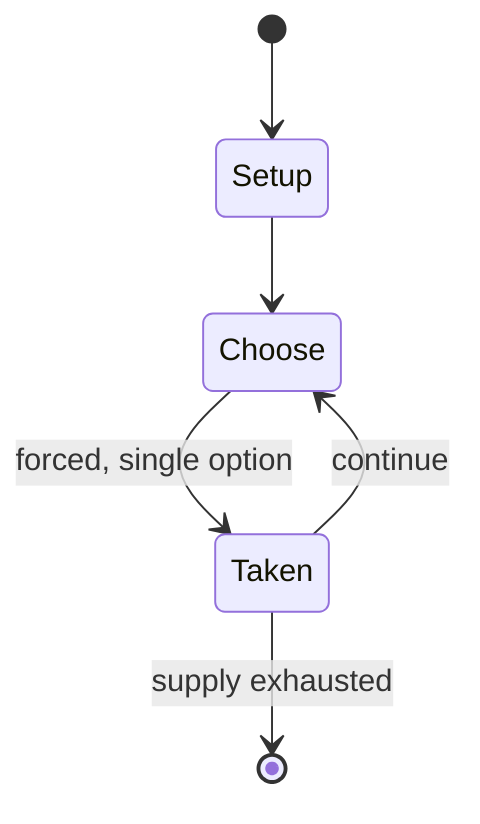

# Zwikken

`zwikken` &nbsp; state: **DEEPENED** &nbsp; method: **heuristic**

## Found layer (recorded, not trusted)

| field | value |
| --- | --- |
| wikidata | Q1894364 |
| wikipedia | Zwikken |
| genres (source) | -- |
| instance of (source) | -- |
| country of origin | -- |

## Declared layer (orders bench work)

| field | value |
| --- | --- |
| year created | -- |
| epoch | -- |
| region | -- |
| media | CARD, GAMBLING, TRICK_TAKING |
| players | -- |
| age band | -- |
| exogenous process | -- |
| loss shape | -- |
| live axes | BID |
| horizon | -- |
| scoring shape | -- |
| information | -- |
| interaction | -- |
| turn structure | -- |
| tractability | SAMPLING_ONLY |
| randomness | -- |
| luck factor | 0.35 |
| rules complexity | 2.04 |
| strategic depth | 2.0 |
| novelty | 0.0896 |
| solved status | -- |
| strategies | -- |
| algorithms | -- |

## Object model

```
Episode
  players      : ?
  turn_structure: ?
  horizon       : ?
  scoring       : ?

Deck           -- ordered multiset, drawn without replacement
Hand           -- private multiset held by one player
DiscardPile    -- public accumulation of spent cards
Trick          -- one card per player; a winner is determined
Trump          -- suit that dominates the ordering
Auction        -- priced competition resolving to one winner
```

## State transition diagram



## Research item -- turn trace

```
# Zwikken -- simulated turn events
# generated from the DECLARED vector, not from a rulebook.
# structure: exo=None loss=None horizon=None scoring=None axes=BID

t=0    SETUP        players=2  pot=0  capacity=8
t=1    FORCED       p1 single legal option taken (pot_gain=+1.0)
t=2    FORCED       p1 single legal option taken (pot_gain=+0.6)
t=3    FORCED       p1 single legal option taken (pot_gain=+0.9)
t=4    BID          p1 sealed bid of 8 against 1 rivals
t=5    ENDTURN      turn passes to p2
t=6    FORCED       p2 single legal option taken (pot_gain=+1.6)
t=7    FORCED       p2 single legal option taken (pot_gain=+1.1)
t=8    FORCED       p2 single legal option taken (pot_gain=+0.5)
t=9    FORCED       p2 single legal option taken (pot_gain=+0.8)
t=10   BID          p2 sealed bid of 3 against 1 rivals
t=11   FORCED       p2 single legal option taken (pot_gain=+1.1)
t=12   FORCED       p2 single legal option taken (pot_gain=+1.2)
t=13   BID          p2 sealed bid of 4 against 1 rivals
t=14   FORCED       p2 single legal option taken (pot_gain=+1.8)
t=15   BID          p2 sealed bid of 1 against 1 rivals
t=16   FORCED       p2 single legal option taken (pot_gain=+1.8)
t=17   FORCED       p2 single legal option taken (pot_gain=+1.2)
t=18   FORCED       p2 single legal option taken (pot_gain=+1.5)
t=19   BID          p2 sealed bid of 1 against 1 rivals
t=20   FORCED       p2 single legal option taken (pot_gain=+1.0)
t=21   FORCED       p2 single legal option taken (pot_gain=+1.4)
t=22   BID          p2 sealed bid of 1 against 1 rivals
t=23   FORCED       p2 single legal option taken (pot_gain=+1.3)
t=24   FORCED       p2 single legal option taken (pot_gain=+0.8)
t=25   BID          p2 sealed bid of 4 against 1 rivals
t=26   FORCED       p2 single legal option taken (pot_gain=+1.6)

terminal: VARIABLE
```

## Conditions

| kind | threshold | effect | trigger |
| --- | --- | --- | --- |
| WIN | -- | -- | Any player who now has a zwik wins immediately. |
| WIN | -- | -- | As before, a player with a zwik wins immediately before play. |

## Source extract

Zwikken (pronounced "tsvikken") is a Dutch gambling game of the trick-and-trump type using
playing cards and designed for three to six players. It is "an old soldiers' game".   == History
== Zwikken is an old Dutch game of French origin, sometimes called in English Dutch Gleek. It
may be related to German Tippen. In the Netherlands it is illegal to play the game in public.
== Zwikken (mid-19th century) == The following is a summary of mid-19th century rules from the
compendium, Nieuwe Beschrijving der Meest Gebruikelijke Kaartspelen ("New Description of the
Most Common Card Games"). The game is played by three to six people, but four or five is most
common. A full pack of 52 cards is used or, if only three play, a Jass pack of 32 cards will
suffice. The dealer antes 3 stakes to the pot then deals three cards each in clockwise order
before turning the next for trump. A round of bidding follows in which players elect to "play"
or "pass" i.e. drop out. However, if agreed beforehand, then "just as in Lanterloo", all must
play in the first and/or second hands, even if they are bound to become bête. A player with 3
cards of the same suit wins the pot and the others are all made bête. I

<sub>Wikipedia, CC BY-SA. Retained as evidence for the structural
classification above. Every rule inferred from it is HYPOTHESIZED
until audited against a rulebook.</sub>
