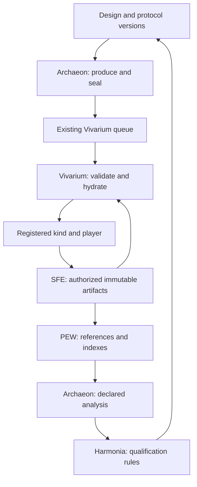

# Prometheus H0–H5 — implementation brief and design v0.1 (verbatim, as supplied by the operator 2026-09-08)

Committed by Archaeon without alteration for the seats to read. The two JSON
packet artifacts named below (prometheus-tool-acquisition-plan.json,
prometheus-h0-h5-backlog.json) were not supplied and are not in the
repository. Seat routing is in 00_ORDER.md beside this file.

---

Implementation brief for Claude Code Fable 5.1

Operator: Jim Craig. Program: Prometheus H0–H5. Design version: 0.1, 2026-09-08.

Use this brief with prometheus-h0-h5-design-v0.1.md, prometheus-tool-acquisition-plan.json and prometheus-h0-h5-backlog.json. The file names are packet artifacts; repository locations below must be reconciled with the actual checkout. No commands described as proposed capabilities are claimed to exist today.

Master instruction — begin here

You are the implementation lead for an incremental expansion of Prometheus. ChatGPT/Codex is the designer; you turn the attached requirements into working components, integration tests and experimental receipts. You may implement across SFE, its client, Vivarium, players/Proteus, Herakles, Archaeon, PEW and Harmonia's executable qualification code while preserving each component's scientific meaning and existing ownership contracts.

The operator has requested sustained implementation, starting with alpha MVPs for H0–H5 and advancing independently through beta, 1.0 and 1.1. Make progress beyond documents and scaffolds. After each completed slice, record the receipt and continue the next unblocked item. Use checkpoints so the work survives context resets. Do not infer that a positive scientific result is required to finish a version.

The initial hypotheses are:

- H0: failure transport and component reuse improve held-out solving; their interaction is a separate, stronger claim.
- H1: relevant compatible source failure inputs improve later CEGIS relative to random-compatible retrieval and fresh search.
- H2: bounded CA dynamics can contribute causally to computation and become reusable stateful components.
- H3: bounded behavioral/random retention improves future utility relative to top-K, uniform and behavioral-only policies.
- H4: adaptive challenges and transfer improve independently evaluated competence.
- H5: a learned balanced decoder improves access to useful variation after phenotype frequencies and total costs are controlled.

Read the full design before making scientific choices. Treat its algorithm sizes as declared pilot defaults, not measured performance promises. Reconcile the actual branch, runtime, schema and host before writing. If an equivalent implementation exists, extend or qualify it rather than duplicating it.

Non-negotiable implementation requirements

1. Preserve the existing sealed-spec identity, exact kind parameter contracts, blinding, no-default rules, SFE isolation and PEW reference-only architecture. No universal organism rewrite. Do not move arm labels or descriptive provenance into the execution hash.
2. The common new input mechanism is a typed immutable artifact slot resolved by Vivarium before execution. Reuse SFE's authorized artifact reads/imports and expected-hash gates. A digest alone never authorizes a read. Verify dependent artifacts, schemas, limits and compatibility before calling a kind.
3. Candidate players receive only their declared channels. The executor may own the task oracle; it must not hand a hidden task implementation or final evaluation set to the player/search policy. No arbitrary Python execution or foreign checkpoint deserialization in SFE.
4. Adaptive CEGIS, encoding search and curricula live inside explicitly declared kinds with policies sealed as inputs. The generic Vivarium loop remains scientific-policy blind. Existing frozen M-SIGNAL behavior remains under its existing protocol.
5. Reuse SFE's resource/enforcement mechanisms. Add producer/executor cost receipts and idempotent attribution. Charge source generation, oracle work, retrieval, readout/decoder learning, extraction and transfer. Record unknown costs honestly. Enforceable means the operation is actually prevented when its budget is unavailable.
6. Preserve original failures, exclusions and attempts. Budget exhaustion is not automatically a logical counterexample, no witness is not automatically success, and a retry is not free. Do not replace authoritative observations because an index publication failed.
7. Use executable verifiers and predeclared analysis rules. No LLM-as-judge. Role prompts and tool documentation are proposals/context, not scientific evidence.
8. Version software maturity, interface identity, experimental protocol, reproduction state and scientific outcome separately. A 1.0 implementation may deliver a negative result. A published tool or a passing unit suite cannot promote a graph edge to demonstrated-transfer.
9. Keep gates local. If a contract is unresolved, supply a failing fixture, concrete options and a proposed amendment, then continue independent work. Do not fabricate a seat's approval or create serial paperwork for routine fixes.
10. Work within the repository's applicable instructions and the operator's existing authorization. Use an isolated worktree/development environment and reversible migrations. Prepare concrete deployment or destructive changes for review where authorization is still required; this must not block authorized local builds and tests. Do not silently restart production services, buy compute or launch a cloud cluster.

First iteration: a real artifact-consuming execution

Complete the following bounded delivery before spending the entire cycle on tool reproduction or architecture documentation.

A. Establish the exact baseline

- Read applicable AGENTS.md, role charters and component instructions. Record the current branch, HEAD, dirty files and any divergent implementation branches. Preserve unrelated work.
- Resolve existing implementations corresponding to: sfe/runtime.py, the SFE client, vivarium/viv/kinds.py, Vivarium's runner/spec validator, proteus/eval/library.py, herakles/evca/core.py, Archaeon's producer/analysis paths and PEW publication/index code.
- Record actual service/schema versions separately from source versions. Do not assume the source pins in the packet form the deployed release.
- Identify existing cost classes, artifact routes, client identity persistence, world visibility, observation identity, retry and outbox behavior. Record the available CPU/RAM/runtime/container capabilities without exposing credentials.
- Write a short machine-readable baseline with present, missing, unverified and evidence paths. This is a work input, not a standalone completion.

B. Implement the smallest loader vertical slice

- Choose a minimal existing compatible kind or add a purpose-specific fixture kind. Do not alter the behavior of an existing kind merely to make the example run.
- Have the producer create a small typed immutable artifact in an authorized SFE world, with its computed digest.
- Submit a sealed payload containing an explicit artifact slot. Keep source/locator provenance outside the execution identity; bind it to the authorized destination artifact.
- In preflight, validate permissions, byte hash, size, schema, interface and closure. Load once and pass immutable data to the kind. The kind cannot query SFE/PEW.
- Return a deterministic scientific result, an artifact-load receipt and measured resource vector. Commit through the existing work lifecycle.
- Publish a PEW reference using an idempotent path. Run one analysis resolving that reference back to the authoritative SFE observation and artifact.

C. Make the boundary failures observable

Use meaningful tests for unauthorized/missing/corrupt/incompatible/oversized artifacts, a post-resolution mutation attempt, budget exhaustion, retry after interruption and duplicate publication. Verify that changing a consumed digest changes the sealed identity, while changing unrelated provenance does not. Verify old no-artifact specs retain their identities and behavior.

Use the alpha resource profile from the design or a lower host-compatible limit. Record which limits were enforceable and which were measured. A stub, mocked scientific execution or a test using only an in-memory fake SFE is not the complete vertical-slice receipt; a temporary real database/runtime in a development environment is sufficient.

D. Return evidence and continue

Return the exact commit(s), components changed, reproduction commands, artifact/observation references, complete resource receipt and scoped test results. Mark anything not run. Then continue H1 alpha and the next independent alpha item in the backlog. Keep status files compact and based on actual completed work.

Incremental lane orders

| Lane | First runnable target | Next useful increment |
|---|---|---|
| H0 | Boolean 2×2 exchange harness with known source components and real artifacts; calculate solve-rate contrast and interaction separately | Replace instrument libraries with source-derived libraries and run the controlled held-out study. |
| H1 | Three-arm bounded Boolean CEGIS with target-recomputed source inputs and exhaustive small-domain verification | Frozen relevance ranking, broader independent tasks and qualified Z3/shrinking adapters. |
| H2 | New radius-3 streaming wrapper, explicit reset/readout and known-memory control | Search CA rules, test matched interventions, export a component and assess frozen reuse. |
| H3 | One complete candidate stream, four retention policies, fixed caps and frozen future queries | pyribs direct-insertion comparator and complete retention/retrieval costs. |
| H4 | Synthetic finite grammar, validity oracle, sealed internal policy and four cells | Harmonia's declared adaptive protocol plus fixed independent evaluation and charged transfers. |
| H5 | Separate radius-1 CA evaluator, exact 256-rule/4,096-genome map checks and producer-side neighborhood probe | Learn/freeze the balanced decoder, then use a sealed adaptive search kind for target optimization. |

H0's Boolean alpha is deliberately earlier than full H1–H2 integration. Do not claim H2 integration until sequence failures and stateful components work through a common temporal task interface. H3 does not require the runtime artifact loader if its replay remains offline. H5 alpha need not send an already applied decoder to the evaluator; beta's adaptive search does consume it.

Component work prompts

Use these as scoped implementation/review instructions. They define responsibilities, not an obligation to spawn more agents. If role sessions exist, pass only the relevant contract and evidence; if they do not, implement the contract locally and preserve the distinction between code completion and scientific admission.

SFE / Daedalus

Inspect the existing artifact and resource paths before adding anything. Implement the minimal client/runtime wiring for preflight-resolvable, world-visible content. Preserve source import provenance and engine-side digest verification. Make cost-event attribution/reservation/reconciliation idempotent and compatible with existing lineage budgets. Do not add a second storage or scheduler system. Supply permission, wrong-hash, double-billing and fork-budget fixtures and an exact end-to-end receipt.

Vivarium

Add explicit artifact slots only to the new consuming kinds. Validate/load before scientific execution, retain the verified bytes for the attempt, and pass no data-service client to the player/kind. Add typed result validation and cost/load receipts. Preserve lifecycle, prediction ordering, idempotent completion and PEW recovery. Keep scientific adaptation inside the admitted kind. Demonstrate interruption/lease handling and old-spec compatibility. External process execution needs a separate named contract; do not smuggle it through an in-process wrapper.

Proteus / players

Expose/reuse pure bounded semantics. Establish input-sensitive positive controls for the proposed Boolean grammar and explicit compile/evaluate parity. Preserve the ordering that defines the first witness and the distinction between exhaustion and mismatch. A witness pack is input data, not a transferred target truth. New candidates use a named population/interface; do not mutate the frozen specimen registry. Supply reset, type, budget, output and independent-oracle fixtures. State the exact finite correctness scope.

Herakles

Preserve the radius-3 density-classification library and its conventions. Add a separately named streaming kind with explicit injection/update/readout order and state reset. Add a separate radius-1 elementary-CA evaluator with hand-derived rule checks. Qualify instrument-positive memory/logic components before searching for CA mechanisms. Separate computation, intervention evidence and reuse results. Record readout capacity, training, extraction and execution costs; do not attribute readout-only computation to the CA substrate.

Archaeon

Implement frozen source selection, manifests, candidate streams and offline H3 replay within existing producer/analysis modules. Prove stream completeness; queue provenance alone may not contain replayable bytes. Freeze descriptors/ranking/decoders before target evaluation. Build comparison families with consistent arm provenance and independent source/target partitions. Add producer resource receipts and explicit counterfactual source-cost attribution. Derive graph/status updates from qualified evidence, not report rhetoric. Preserve the existing admitted acquisition route when a new lane is blocked.

Mnemosyne / PEW

Index typed references for witnesses, components, tasks, decoders, source sets and evidence receipts. Do not copy raw artifact bytes into a new scientific store. Preserve observation identity, visibility and origin. Make publication retryable and idempotent without rerunning completed science. Allow witness retrieval only from an explicitly authorized source scope. Expose software stage, connection evidence and scientific outcome as separate fields. Demonstrate rebuilding an index from authoritative references.

Harmonia

Turn the design into versioned executable qualification and analysis rules. Verify each lane's positive control and a deliberately misleading/invalid case. Declare independent units, all assigned-task denominators, exclusions/retries, paired contrasts, practical effect threshold, uncertainty and multiplicity handling. Write H4's adaptive protocol and distinguish it from M-SIGNAL. Freeze the confirmation plan from disjoint pilot data before final results are opened. Your review must be able to return unsupported or inconclusive without blocking release of a valid implementation. Do not use an LLM's confidence as a test statistic or verdict.

Tool-reproduction implementor

Use the acquisition manifest's official repositories and observed source pins as starting candidates. Resolve an isolated environment lock, exact dependency/submodule/dataset hashes and host limits. Start native MVP work while bounded tool setup proceeds independently. Begin with Stitch's small fixture and a DreamCoder domain smoke run; then freeze a specific published reproduction target. Do not claim the absent README-linked DreamCoder recipe was found. Record deviations, timeouts and negative reproduction results. Export only declarative, independently verified components. Tool installation, paper reproduction, adapter qualification and local scientific benefit are four separate deliverables.

Tool work and download discipline

Use package identifiers z3-solver, hypothesis, ribs, stitch_core after resolving exact compatible versions and distribution hashes on the host. For repository tools, verify the manifest's immutable revision and pin submodules. A moving upstream head is not a qualified release. Keep licenses/notices with the tool copy and record unresolved licensing rather than guessing from a repository API classifier.

Keep DreamCoder's old toolchain in its own environment. First integrate it as an offline library producer. If you need an external solver/process tree during a scientific run, implement the bounded backend contract with process-tree cancellation, lease renewal, limits, repeatability checks and explicit output validation. Do not install all heavy tools into SFE's interpreter or launch the POET cloud launcher as a default.

An integration must have a named consumer. For Stitch, demonstrate semantics-preserving expansion before measuring later solving. For Z3, handle unknown and resource exhaustion distinctly. For Hypothesis, isolate its saved-example database across data scopes and persist explicit minimized fixtures. For pyribs, feed the identical stream directly into archives; do not activate emitters/schedulers in the retention experiment. For POET, distinguish original from Enhanced POET and their task distributions.

Definition of a complete iteration

Write one structured iteration receipt and a short human explanation:

```json
{
  "iteration_id": "<resolved identifier>",
  "design_version": "0.1",
  "work_items": ["<backlog ids>"],
  "baseline_commits": {},
  "result_commits": [],
  "components_changed": [],
  "commands_run": [],
  "tests_and_controls": [],
  "artifact_and_observation_refs": [],
  "resource_receipt_refs": [],
  "source_set_ref": null,
  "software_stage_changes": [],
  "evidence_state_changes": [],
  "scientific_outcomes": [],
  "unrun_or_blocked": [],
  "design_deviations": [],
  "next_unblocked_action": "<concrete action>"
}
```

This is a report template. Resolve identifiers and fill actual evidence; do not populate it with invented successes. Report exact commands from the implementation, not a CLI invented by the design packet. Preserve stdout/stderr and machine-readable results for failures as well as successes. Scientific replay compares a declared normalized result projection; timestamps and resource timing remain in the complete receipt.

The accompanying prose should answer: what now runs, what it teaches us, what remains uncertain, and which next consumer it enables. No unsupported percentage-complete estimate. Do not replace a precise failing boundary with a new architecture proposal.

Continuation instruction

On each restart, read the compact status and the latest actual receipt. Resume the next unblocked backlog item against the recorded versions. If implementation evidence contradicts the design, make the smallest explicit amendment supported by that evidence and preserve the old result. Routine fixes proceed; unresolved changes to scientific meaning are presented to the designer with a minimal failing example and concrete alternatives while other lanes continue.

Begin now with the baseline audit and the real artifact/cost round-trip. The first return should contain runnable evidence and the next alpha slice in progress, not another broad roadmap.

---

Prometheus H0–H5 — implementation design v0.1

Prepared 2026-09-08. Designer: ChatGPT/Codex. Intended implementor: the operator's Claude Code Fable 5.1 session. Scientific protocol and qualification: Harmonia. This is a proposed build contract and experiment program, not an execution report. No external tools were installed or experiments run while preparing it.

1. Decision and objective

Expand the existing SFE ecosystem incrementally. Preserve its durable worlds, work lifecycle, sealed execution identity, isolation, provenance and evidence history. Add the smallest experiment-specific components needed to test whether failures, executable components, retained diversity, generated challenges and learned encodings improve subsequent solving at matched resource caps.

The first objective is six honest alpha experiments, H0–H5, each able to produce a meaningful failed run as well as a successful one. Each lane then advances through beta, 1.0 and 1.1 independently. A working implementation can reach 1.0 even when its scientific hypothesis is unsupported. No milestone requires a positive finding.

The scientific objective is cumulative usefulness: an experiment produces something a later experiment can consume, and that consumption has an independently measured effect. Output counts, archive diversity, successful installations and appealing graphs are not substitutes for this effect.

The operating model is one coherent implementation program. Fable implements across the existing component boundaries; the named seats retain semantic ownership. A local contract problem blocks its consumers, not the entire program. Existing Tier 1 acquisition continues within its existing resource allocation.

2. Evidence baseline and corrections to the starting proposal

The following sources were inspected. They establish source shape, not the state of a running service. Fable must record the actual host, branch and commit for every component before changing it; the inspected branches are not assumed to form a jointly deployed release.

| Evidence | Finding | Consequence |
|---|---|---|
| SFE infrastructure annex, 2026-09-07 (archaeon/docs/expansion/INFRASTRUCTURE.md on archaeon/v0) | Common sealed inputs, observation references, budgets and analysis families; adaptive algorithms can live inside sealed kinds. | Extend this framework. Do not rewrite it as a universal organism runtime. |
| Proteus evaluation library at 4f5e4c6 (proteus/eval/library.py) | Pure evaluation; ordered input cases; first eligible mismatch witness; explicit budget policy; passive bounded traces. | H1 has a real semantic library to build on. Its CEGIS policy and integration remain separate work. |
| Herakles CA library on the reported implementation branch (vivarium/v0-2026-09-05, herakles/evca/core.py) | Radius 3 only, periodic ring, odd lattice, explicit step count, fixed rule-table convention. | H2 is a new streaming kind; H5 needs a separately defined radius-1 kind. |
| SFE runtime at 4f5e4c6 (SerendipityFoundry/SerendipityFoundryEngine/sfe/runtime.py) | Artifact creation, policy-gated content retrieval/import, hash checking, resource enforcement classes and shared lineage budgets exist. | Reuse these primitives. The missing work is wiring, complete accounting and qualification, not a second artifact store or budget engine. |
| Vivarium kind registry at 4f5e4c6 (vivarium/viv/kinds.py) | Exact parameter sets, no executor defaults, explicit implemented/retired state. This snapshot does not register the new research kinds. | A finished semantic library is not a runnable Vivarium kind. Preserve that distinction. |

Archaeon's assessment supplied by the operator is accepted as an implementation lead. Four refinements are incorporated here:

1. The artifact loader is the common input extension. It must verify authorization, bytes, schema, dependencies and compatibility; a digest alone is not authority or semantic compatibility.
2. Queue provenance may not be a complete replay stream. H3 needs ordered candidate identities, recoverable candidate bytes, evaluation inputs/results and the records of rejected or failed candidates within its declared universe. A queue index alone does not establish these.
3. H0 needs a common task interface. Its first alpha uses Boolean programs and verified Boolean library components. Combining H1 with stateful H2 components requires a later temporal-program adapter. This removes a needless dependency on H2 for testing factorial plumbing without pretending CA transfer has occurred.
4. Heavy tools add a second execution concern. Offline production of frozen artifacts can precede engine integration. Running DreamCoder, POET or a process tree during a scientific run requires an explicitly bounded external execution contract. The loader does not grant process-spawning permission.

H5 has two legitimate routes: applying a frozen decoder before submission requires producer provenance but no runtime decoder loader; an adaptive search that repeatedly applies it inside a kind requires the decoder as a sealed input. This design uses the first route for alpha and the second for the later search experiment.

3. Architecture and authority



These arrows describe logical ownership. Writes to SFE go through its existing authorized runtime/client boundary; the player is not handed an SFE client. The analysis-to-protocol path produces a new version for a future campaign, not a change to an already sealed confirmation run.

| Component | Owns | Must deliver for alpha | Boundary |
|---|---|---|---|
| SFE / Daedalus | Durable worlds, work, artifact visibility, budget accounting, event identity | Authorized artifact resolution and cost events using existing primitives | Hash knowledge never bypasses world visibility or sharing policy. |
| Vivarium | Queue lifecycle, admission, preflight loading, faithful execution, recording and recovery | Loader, exact kind contracts, heartbeat/cancellation behavior and resource receipts | Generic runner never chooses a scientific next step from results. |
| Proteus / players | Program semantics, runtime and affordance identity, executable input/output contract | Input-sensitive positive controls and bounded Boolean program support | Existing frozen specimens remain frozen. New generated candidates use their own declared population. |
| Herakles | CA conventions, transformations, reference implementations and assays | Streaming wrapper and separate elementary-CA library | Radius, bit order, boundary and readout changes create new contracts. |
| Archaeon | Candidate production, source selection, archive replay, plan construction and analyses | Frozen source packs, task splits, replay streams, design manifests and cost attribution | Retrieval is restricted to the declared source universe; confirmation data never tunes it. |
| Mnemosyne / PEW | Searchable references, typed presence indexes, evidence and relationship presentation | Witness/component/task/decoder references and idempotent publication | Raw scientific bytes remain in SFE. Index rebuilds do not alter execution identity. |
| Harmonia | Controls, independent units, analysis rules, qualification and test cycles | Versioned protocol, adversarial fixtures, analysis code requirements and deterministic decision rules | Narrative review does not replace the executable oracle or invent positive results. |
| Fable implementor | Integration, local builds, tests, commits, receipts and repair | One working vertical slice at a time across these components | Can implement the owners' contracts; cannot fabricate their approval or silently change scientific meaning. |
| Designer and operator | Requirements, explicit design amendments and priorities | Resolve material design forks from concrete evidence | Routine reversible implementation proceeds without synchronous eight-seat approval. |

4. Shared contracts

C1. Immutable artifact input and preflight hydration

A new artifact-consuming kind explicitly declares each artifact slot. Do not add a generic extra field to every old payload or relax the exact-key validator.

An illustrative slot is:

```json
{
  "failure_inputs": {
    "digest": "sha256:<64 lowercase hex digits>",
    "artifact_type": "failure_input_set",
    "schema_version": "1",
    "codec": "canonical-json-v1",
    "expected_bytes": 2048,
    "interface_id": "boolean-inputs-v1"
  }
}
```

This is a contract sketch, not a currently accepted SFE request. All values must be resolved before admission; placeholders never enter a queue.

The kind consumes the bytes, and preflight consumes the declared type, schema, size and interface as validation conditions. Source-world locators, source observations, arm labels and retrieval rationale remain provenance outside spec_hash. If the existing authenticated API needs (world_id, artifact_id), the authorized resolution record binds that locator to the sealed digest. Never invent a global digest-fetch endpoint or expose a raw CAS path.

Preflight sequence:

1. Validate the complete payload against the exact versioned kind contract.
2. Resolve each slot through artifacts native to, or legally imported into, the execution world. Verify authorization before serving a shared cache hit. Preserve the engine's registered topology and source-policy requirements, including restrictions on re-exporting imported artifacts.
3. Load the immutable bytes once; verify the digest, expected size, codec, schema and declared interface. Reject unbound or mismatched dependencies. A component's transitive dependency closure is explicitly listed under a hashed manifest; no latest, glob, mutable URL or directory scan is allowed.
4. Check the configured total-byte, per-artifact, nesting, item-count and trace limits before constructing runtime state. Dependency cycles are rejected unless an explicitly supported component language gives them bounded semantics; alpha forbids them.
5. Construct immutable inputs and a load receipt. Bind exactly those bytes to the execution attempt. Revalidate on a new attempt; avoid a check/use race by retaining the verified bytes or an immutable handle to them.
6. Start the kind without an SFE, PEW, filesystem or network client. Any learned library is typed data for an admitted interpreter, not an arbitrary Python object or a dynamic import.

The transport contract does not equate an NK vector, a program witness and a CA trajectory. Their semantic adapters have separate identifiers and tests.

Required loader rejection fixtures: absent artifact, wrong digest, unauthorized world, cache access without permission, wrong type, incompatible interface, missing dependency, over-size input, malformed content, mutation after resolution and attempted mutable lookup. Rejection creates an operational receipt and no scientific success observation.

C2. Typed scientific objects

| Object | Required scientific content | Essential checks |
|---|---|---|
| Failure input set | Ordered inputs or sequences, input interface and source-set reference in provenance | Import no source expected labels into the target solver; the target oracle recomputes them. |
| Program component | Typed AST/bytecode, runtime version, parameter signature, dependency closure, reset semantics and expansion | Type checking, bounded execution and equivalence to its expansion within the declared domain. |
| Stateful component | Initial-state specification; `reset`, `step(state,input) -> (state,output)` semantics; port order; readout and limits | Replay, reset independence, state-size bound, intervention scope, composition equivalence. |
| Candidate stream | Stable ordered IDs, candidate digests, birth status, fixed assay references, recoverable results/traces | Completeness against the declared stream universe and identical insertion order across replay policies. |
| Generated task | Task grammar/version, task parameters, interface and validity evidence | Parse validity, bounded oracle, admissible task range and disjoint final-evaluation scope. |
| Decoder | Finite map or bounded decoder program, domain/codomain, multiplicities, dependency closure | Totality, cardinality, reachable phenotype set and exact frequency preservation. |

Provenance links these objects to source observations and construction costs. Scientific bytes contain execution content; descriptive metadata does not become an unused hashed payload field.

C3. Adaptive execution and player interfaces

Seal the algorithm rather than every future decision. A kind's initial state, allowed observations, update policy, RNG streams, resource limits and stopping rule are execution inputs. Its inner loop may choose candidates, counterexamples, challenges or transfers using only those admitted inputs and its own previous internal results.

The generic runner performs execution management only. Archaeon may prepare a frozen retrieval pack before the run; it does not perform an undeclared CEGIS step between individual queue rows. H4 likewise cannot change curricula through an unregistered outcome-driven producer path.

An executor's access to a task oracle does not grant that oracle's entire truth table or target implementation to a candidate player. Pass only the defined channels to the VM. Generated programs execute in a bounded admitted language, never arbitrary Python eval or deserialized executable objects. Check input sensitivity with hand-constructed positive controls before treating a frozen population as capable of a task.

Internal state across steps is distinct from repeat.state=persist across observations. Alpha stores one bounded inner run as one observation plus a trace artifact. It does not mislabel generations as independent replications. A later checkpoint/resume contract must include RNG, solver/archive/task state, cost counters and policy version; replay from the beginning remains an explicit, charged alternative.

B1's budget exhaustion is a separate status under its normal policy. H1 must not treat witness == null as correctness: exhausted or unevaluated cases can also produce no witness. solved requires complete coverage of the declared finite verification scope and the kind's explicitly permitted completion statuses.

C4. Resource accounting and enforcement

Extend the existing engine resource mechanism and the producer's provenance. Every paid activity emits a unique cost_event_id, attempt ID, stage, source/output artifact references, hardware/environment identity and a resource vector. Useful stages include generation, oracle, verification, retrieval, retention, extraction, decoder training, readout training, transfer, execution and analysis.

For each resource record quantity, unit, measurement method, enforcement class and attribution scope. Reuse the engine classes enforceable, measured, estimated, unavailable. Unavailable is not zero. Record CPU seconds, wall seconds, optional GPU seconds, oracle calls, VM operations, CA cell updates, solver calls, retained/output bytes and peak memory where applicable.

Accounting rules:

- Sum additive work quantities; do not sum peak-memory samples or overlapping wall durations. Report per-job peaks and a measured campaign peak, or mark the latter unavailable. Campaign elapsed time and total worker-seconds are different fields.
- Record actual source construction costs once in the physical ledger. In each counterfactual comparison arm, attribute the cost that arm would require under the frozen reuse horizon. Do not count one shared source build four times as actual expenditure, and do not make it free for one scientific arm.
- A cost event has one billing owner. Parent roll-ups reference child events rather than billing them again. Implement reconciliation between producer, executor and analysis receipts.
- Reserve or debit enforceable logical counters before performing the operation. A post-hoc debit alone does not enforce a limit. Persist the reservation/settlement behavior and test recovery; reuse engine lineage budgets so forks cannot multiply an allowance.
- Real retries consume real resources even when idempotent completion prevents duplicate observations. A lost receipt makes accounting incomplete; it does not create a zero-cost run.
- Use a fixed resource envelope and hardware stratum. Primary results include source acquisition and construction; amortized results name a predeclared reuse horizon. Never collapse costs into undisclosed scalar weights.
- Logical step/call limits define replayable scientific stopping. Wall-clock and memory guards protect operations; a guard interruption gets a distinct status. Do not promise bit-identical completion across hardware or wall-clock interruption points.

Proposed alpha operational profile: CPU only; at most two concurrent research jobs; one algorithm thread per job; 2 GiB per job where enforceable; 60-second job guard; 16 MiB total input artifacts and 8 MiB trace/output cap per job; no paid model calls. One alpha comparison is capped at ten minutes. These are starting limits, not performance measurements. The host audit may lower them; any raised or scientifically consequential limit is versioned before a new run. Heavy-tool builds/reproductions use a separate explicit profile and never borrow unlimited resources from alpha.

C5. Result, evidence and publication

A kind returns structured completion status, task-level success records, work counters, bounded witnesses/traces and artifact references. Register result paths and types so producers and analyses never guess field names. Preserve existing observation identity (world_id, observation_id, event_seq, entry_hash) and source-set conventions.

Represent these axes separately:

| Axis | Values / interpretation |
|---|---|
| Software stage | planned, alpha, beta, 1.0, 1.1; each component and lane advances independently |
| Connection evidence | conceptual; runnable with endpoint pins, typed end-to-end execution and complete resource receipt; demonstrated-transfer with controlled held-out effect |
| Scientific outcome | not-run, inconclusive, supported-in-scope, meaningful-effect-not-supported, harmful-in-scope |
| Reproduction | source-resolved, built, smoke-passed, benchmark-attempted, reproduced-in-scope, failed, blocked |

A negative but valid experiment can be software 1.0 and connection runnable. A test suite cannot promote it to demonstrated-transfer. Documented upstream results cannot promote a local connection.

SFE is authoritative for bytes and observations. PEW stores references, typed presence indexes, summaries and evidence links. An idempotent outbox or equivalent existing recovery mechanism retries PEW publication without rerunning completed science. Report recorded_in_sfe and indexed_in_pew separately. If a spec makes PEW mandatory, preserve its terminal-state rule while recovering publication; do not erase the durable observation or duplicate execution.

The graph can consume these records later: hypothesis → experiment → artifacts consumed/produced → controlled result. Evidence edges identify the experiment, source/target pins and effect. A graph update is downstream presentation, not a promotion mechanism. Updating the existing interactive graph or deploying it is outside this design packet's implementation status.

C6. Analysis and Harmonia's cycles

Each analysis declares source-set hash/count, sampling unit, exclusions, analysis version, primary contrasts, practical effect threshold and uncertainty procedure. Prefer paired comparisons within an independent seed/task block; declare whether inference concerns a fixed task catalogue or sampled task families. Generations, mutations, candidates and examples within one run are not independent replicates.

Use source development, protocol-development and final-confirmation partitions. Seal the target set before results are visible and enforce its information boundary; hashing a file does not hide it. A neutral evaluator can hold final labels and return evaluation only after policies are frozen. Algorithms receive only their licensed training/query interface.

Alpha uses two paired seeds and four target tasks per arm where meaningful. Beta starts with eight paired seeds and a modest task batch. These are diagnostic sizes. Harmonia determines confirmation size from disjoint pilot variability and the declared effect before opening final results. A five-percentage-point solve-rate threshold is a proposed starting value, not a known achievable effect; freeze the selected threshold and precision plan.

Tasks assigned to an arm remain in its denominator. Distinguish scientific budget exhaustion, invalid candidates, invalid tasks and infrastructure failure. Budget exhaustion is unsuccessful solving within budget. Infrastructure failures retain records and trigger the same predeclared retry/missingness rule for all arms; never silently drop them. Report assigned, completed, solved and each failure category. Certification can be withheld for incomplete execution even while the conservative assigned-task solve rate is displayed.

Harmonia's cycle is executable: contract fixtures → positive/negative controls → paired pilot → frozen confirmation → effect/uncertainty → scope-specific decision. Include a planted leak, wrong-artifact case, known invalid witness, swapped labels, exhausted run and no-effect synthetic dataset. The analysis should detect the planned distinctions without any LLM verdict. A protocol amendment creates a new experiment version and preserves earlier results.

5. Experiment MVPs and release ladders

All numerical sizes below are proposed alpha/pilot defaults to calibrate, not published benchmarks. Kind names are proposed until reconciled with the actual registry. Reuse an existing equivalent instead of adding a synonym.

H0 — Does combining failure transport and component reuse help?

Claim. At the same total resource caps, failure transport plus component reuse improves held-out solving. The stronger claim is a positive interaction beyond the two separate effects.

Alpha MVP. Use the same bounded Boolean program interface as H1. Source programs supply small verified Boolean subprograms; a simple deterministic extractor may retain repeated typed subtrees. Hand-built library fixtures exercise the plumbing but are explicitly instrument controls. Produce source failure inputs and a frozen component library. Run four cells: neither exchange, failures only, library only, both. Every cell retains ordinary within-task CEGIS.

Primary quantities are S11 - S00 and the separately reported interaction I = S11 - S10 - S01 + S00, on the solve-fraction scale. These are analysis results, not executor outcome rules. Use paired blocks and simultaneous/multiplicity-adjusted uncertainty for the predeclared primary contrasts. Additive improvement can be valuable without supporting the interaction claim.

| Cell | Source failure transport | Frozen component library |
|---|---|---|
| S00 | Off | Off |
| S10 | On | Off |
| S01 | Off | On |
| S11 | On | On |

Off means an explicitly empty/absent input under the kind's declared contract, not a hidden alternative library or extra preparation budget. The cell name remains design provenance; the actual consumed inputs determine execution identity.

Controls. Same base primitives, solver policy, independent target tasks and resource envelopes. Charge source failure and library acquisition in the cells that use them. In beta include matched unrelated libraries and the equivalent inlined implementations; count expanded execution cost so macro names do not create free computation. Do not require a library to expand unbounded expressive power to establish bounded search utility.

| Stage | Deliverable and exit condition |
|---|---|
| Alpha | Four correctly assigned cells, real artifacts consumed, complete denominator/cost table, instrument-positive and no-effect fixtures; no synergy claim. |
| Beta | Source-derived library, relevant/random failure controls, frozen task splits, paired full-loop run and tested interaction estimator. |
| 1.0 | Qualified Boolean integration experiment and locked confirmation analysis, whether positive, negative or inconclusive. |
| 1.1 | Temporal extension: H1 transports finite input sequences and H2 contributes stateful components through one tested temporal-program interface. Run all four cells again. |

Dependencies. Alpha needs loader, costs, analysis and the H1 Boolean substrate; it does not wait for H2. A full H1–H2 integration claim waits for H2 reuse evidence and the temporal adapter. Do not describe the Boolean alpha as evidence for dynamical-component transfer.

H1 — Do relevant prior failures improve later search?

Alpha MVP. Implement cegis_boolean_v1 around the existing pure VM where feasible. Start with 3-input Boolean tasks, exhaustive verification over all 8 inputs, a bounded typed grammar (input, constants, NOT, AND, OR, XOR) and a fixed seeded candidate enumeration/search policy. Compile to a declared subset of Proteus semantics and check parity against an independent truth-table evaluator. If the current input channel cannot implement this subset, record the exact failing positive control and implement an explicit new player interface; never redefine old specimens.

Generate source failures on source tasks only. The producer selects a fixed source-input pack using either a frozen relevance policy or random compatible retrieval. Alpha can rank by a declared structural signature of task specification visible equally to all arms; it cannot use hidden target labels or target-family provenance to recognize answers. Record the licensed task metadata and the baseline's equal access to it. If no fair relevance feature exists yet, alpha demonstrates transport only; beta must supply a prospectively defined ranking before testing relevance.

Compare: fresh search with its own CEGIS loop; the same plus random compatible source inputs; the same plus relevant source inputs. Every retrieved input is queried against the target oracle. Give the fresh arm an equal allowance for fresh target probes. If the pool cannot supply K distinct inputs, use the predeclared shortfall rule in every retrieval arm and report actual counts.

The kind seals candidate policy/version, source pack, oracle interface, case ordering, seed streams, maximum candidates, oracle/candidate-operation caps, trace bound and termination policy. The final exhaustive check is charged, including evaluation of rejected candidates where applicable. H1's alpha small truth space may saturate; beta widens only after a disjoint pilot, with no retrospective search for favorable task partitions.

Output. Candidate trajectory, ordered counterexamples, target-recomputed labels, case coverage, termination statuses, final verification, source-item usage and full costs. no witness alone is never solved.

| Stage | Deliverable and exit condition |
|---|---|
| Alpha | One real failure pack round-trip through SFE/Vivarium; all three arms; exhaustive-oracle parity; wrong-source-label and budget-exhaustion traps pass. |
| Beta | 4–6 input tasks or a bounded bit-vector extension; source-only ranking; deterministic shrinking; optional Z3 adapter cross-checked against exhaustive small instances. |
| 1.0 | Frozen relevant-versus-random primary contrast and fresh baseline; powered independent evaluation; resource-to-solve secondary includes unsolved cases. |
| 1.1 | Sequence counterexamples for the H0/H2 temporal kind or a separately qualified program domain; DreamCoder proposer comparison with fixed selector/oracle. |

Reject the meaningful-effect claim if its upper confidence bound is below the frozen threshold; call it inconclusive if the interval straddles the threshold. Extra oracle access or overlapping source/target solutions invalidate the intended causal interpretation even if solve rate rises.

H2 — Can CA behavior become a reusable computational component?

Alpha MVP. Add ca_stream_v1 over the radius-3 transition library. Preserve its historical density-classification kind. Start with a 31-cell ring and an explicit update convention: inject at declared ports, take exactly one CA step, then read out; reset before every independent stream. Initially use one binary input port, horizon 8 and a frozen complete 256-stream Boolean catalogue for delayed recall and adjacent-bit temporal XOR. The complete catalogue checks trusted oracles and known controls; scientific learning uses disjoint training/development/confirmation partitions (a proposed split is 64/64/128), with confirmation labels inaccessible to rule search and readout fitting. New composition tasks are separately withheld from component selection. Declare warm-up masks for delayed targets. Wider conditional routing uses a separately frozen finite multichannel stream set.

A stateful component includes the CA rule, port map, reset state, update timing, readout class and fitted parameters. Start with a capacity-limited linear readout over the current lattice; no undeclared input history. Freeze the training stream set, regularization, threshold, feature count and training budget. Train/freeze each component before testing its reuse. Use known shift-register/logic components to prove that the task instrument and composition interface can pass; those are positive controls, not discovered CA mechanisms.

There are three separate stages of evidence: (a) useful bounded computation, (b) causal contribution under matched interventions, (c) frozen reuse on new compositions. A whole reservoir can satisfy (a) without yielding a localized primitive for (b) or (c).

Compare searched CA rules with matched random rules; readout-only/direct-input baseline; targeted intervention with matched random intervention; new composition with the component, without it, with an unrelated matched component and with its equivalent expanded implementation. Match state size, readout capacity, intervention magnitude and all training/extraction costs. Criticality measures remain passive diagnostics.

| Stage | Deliverable and exit condition |
|---|---|
| Alpha | Streaming/reset/readout contract, hand-computed temporal fixtures, known-memory positive control, readout-only baseline and an actual CA run; no discovered-component claim. |
| Beta | Bounded rule search, interventions with matched controls, immutable export/import and frozen composition runner. |
| 1.0 | Separate computation, causal-contribution and reuse results on untouched finite task manifests; a null mechanism result is retained. |
| 1.1 | Temporal H0 integration; learned library proposals from Stitch/DreamCoder only where their program adapters preserve component semantics. |

Negative interpretations. If the readout explains the gain, the substrate attribution fails. If lesions are no more informative than random damage, localized mechanism evidence fails. If a component works but does not improve new compositions after full accounting, the reuse hypothesis fails in scope. These do not require discarding the CA runner.

H3 — Does retained behavioral diversity have prospective value?

Alpha MVP. Produce one fixed stream of 1,024 bounded executable candidates per seed, including IDs for failed evaluations, and replay it offline through four policies: top-K source performance, uniform reservoir sampling, fixed-descriptor behavioral archive and a behavioral/random hybrid. Proposed total capacity is 64 items plus an independently enforced byte cap; for the hybrid reserve 16 items for the uniform component. These are development choices, not universal constants.

Use compatible NK/program/CA candidates only within a single declared replay experiment. Queue provenance points to the stream; an explicit artifact manifest makes it complete and replayable. Descriptor definitions, bins, tie order and capacity are frozen. Insertion, eviction and retained-set digests are recorded. Both the behavioral and random portions count against the same total caps; duplicate items do not silently expand capacity.

The initial source generator is policy-independent. Retention cannot alter its candidates or observe future query labels. Freeze each archive before replaying a separately sealed future-task manifest. Score direct candidate reuse and, if enabled, the same bounded adaptation procedure in all arms. Charge descriptor computation, ingestion, eviction, retrieval and adaptation. This is a retention experiment, not an adaptive MAP-Elites generation experiment.

| Stage | Deliverable and exit condition |
|---|---|
| Alpha | Exact same ordered stream across four policies; deterministic tie fixtures; memory/item cap enforcement; frozen archives answer a small future query set. |
| Beta | pyribs archive adapter, source-stream completeness audit, source-independent future tasks, policy cost receipts and byte-cap parity. |
| 1.0 | Predeclared prospective-utility comparisons with multiplicity handling; archive diversity is secondary. |
| 1.1 | New descriptor family or second task kind tested as a new study; adaptive generation, if pursued, becomes a separate intervention. |

Failure criterion. More measured diversity without meaningful later solving benefit is a negative prospective-utility result. No retrospective descriptor changes or cherry-picked query subset can rescue it.

H4 — Do adaptive challenges and transfer reinforce one another?

Alpha MVP. Build curriculum_discrete_v1: a bounded task grammar on the Boolean program substrate, a trusted validity oracle, a small solver pool and a sealed internal curriculum policy. Use four task slots and at most eight curriculum rounds initially. Grammar transformations can permute input positions, negate declared inputs/outputs or compose already admitted Boolean operations, with explicit mappings. Known valid/invalid tasks and known transferable solvers are instrument fixtures.

The policy specifies task proposal, validity rejection, task admission/difficulty rule, solver update allocation, transfer source/target selection, archive replacement and stopping. Every choice is made inside the kind from its own allowed training observations. The producer supplies initial artifacts and policy only. Both proposal failures and transfer failures are recorded and charged.

Run a 2×2 design: fixed/adaptive curriculum × transfer off/on. Use the same base search and total generation/training/transfer caps. The fixed curriculum's precomputation is charged. A separate evaluator tests every arm on the same frozen final suite and historical suite; training never receives these labels. Track cycling/forgetting on the historical suite without feeding it back unless a separate protocol explicitly licenses that use.

The alpha loop can be implemented and exercised on synthetic training tasks while Harmonia writes the adaptive scientific protocol. Its scientific campaign begins only under that declared protocol; no silent admission into M-SIGNAL. Other hypotheses continue.

| Stage | Deliverable and exit condition |
|---|---|
| Alpha | Validity oracle, finite policy loop, deterministic decision trace, all four cells and fixed independent evaluator; hand-built transfer positive control. |
| Beta | Versioned Harmonia adaptive protocol, complete cost/denominator accounting, restart behavior and actual solver/component transfer. |
| 1.0 | Independent competence and retention analysis, reporting combined effect and interaction separately. |
| 1.1 | A second grammar or qualified external environment; separately attempt original/Enhanced POET reproduction on its intended branch. |

Failure criterion. Training challenges becoming harder does not establish competence. Improvement confined to co-adapted tasks, cyclical forgetting or additional computation fails the intended explanation. A finite successful run never demonstrates indefinite open-endedness.

H5 — Do learned encodings improve access to useful variation?

Alpha MVP. Implement eca_rule_eval_v1, a separate elementary CA kind: radius 1; periodic ring; index = 4*left + 2*center + right; output (rule_number >> index) & 1. Verify rules 0, 255, 204, 170, 240 and 90 against hand-derived behavior. Do not reuse radius-3 hex decoding under a new number.

Use a 12-bit genome with all 4,096 values and a catalogue of 256 rules, exactly 16 encodings per rule. Direct decoder: the low 8 bits. A balanced alternative and a seeded permutation null preserve every rule's multiplicity. Match starting phenotype, sample its genotype preimage according to a declared rule, and flip exactly one uniformly selected genome bit. Test fixed neighborhoods first; this makes the decoder producer-side and leaves the evaluator consuming only the resolved rule.

A small initial assay uses 7-cell rings, all 128 initial configurations and a fixed 8-step horizon. Source/development/target tasks are separate teacher-rule/trajectory specifications, deduplicated by observable behavior on the declared scope; retain equivalence classes rather than pretending synonymous teachers are independent tasks. Record limits of inference to this finite catalogue.

For beta, learn a balanced decoder on source task scores using a finite number of swaps of map entries and a declared objective over genotype neighbors; swaps preserve multiplicities exactly. Freeze it before target evaluation. An adaptive search kind, encoding_search_v1, consumes the decoder through C1 and implements the fixed selection/mutation policy internally. The ordinary elementary-CA evaluator remains unchanged.

Compare direct, learned balanced and scrambled learned decoders. Match genotype length, complete reachable catalogue, phenotype multiplicities, initial phenotype distribution, mutation operator and target evaluation budget. Charge training and decoding; report total-cost results before any reuse-horizon amortization. Measure functional offspring yield on independent parent samples as well as search solve fraction.

| Stage | Deliverable and exit condition |
|---|---|
| Alpha | All 256 rules obey the convention; all 4,096 decoder entries satisfy exact counts; fixed-neighborhood comparison and producer provenance round-trip. |
| Beta | Bounded balanced-map training, frozen decoder artifact, adaptive search kind and independent parents/tasks. |
| 1.0 | Held-out solve fraction plus offspring-yield analysis under fully matched multiplicities and cost caps. |
| 1.1 | Larger generative encoding or a new phenotype family; lifetime plasticity/Baldwin effects require their own explicit experiment. |

Failure criterion. Benefits disappearing after frequency, initial-phenotype or training-cost controls do not support the claimed representation effect. A hand-designed or scrambled alpha decoder is an instrument, not evidence for learned evolvability.

6. Release meaning and test gates

| Release | Required gate | Permitted claim |
|---|---|---|
| Scaffold | Contract, registered proposed identity, positive/negative fixtures and a concrete next runnable slice | Planned; not runnable if execution is stubbed. |
| Alpha | One real bounded execution through the relevant data path; artifact/cost/result receipts; known controls | The scoped implementation works on its fixtures. |
| Beta | All comparison arms; failure/recovery checks; independent development pilot; full accounting and analysis | The experiment is ready for a frozen confirmation design. |
| 1.0 | Locked runtime/tool/data/protocol versions, adequate confirmation design, analyzed results and durable evidence bundle | Supported, unsupported or inconclusive only within the stated scope. |
| 1.1 | A named additional capability with preserved old fixtures and separate new evidence | An extension, not retroactive improvement of the earlier result. |

Release labels attach to a lane and component, not a whole new substrate era. Schema, policy, tool-adapter and analysis versions evolve independently. Breaking semantics gets a new kind/interface version. Keep a compatibility table and old fixtures executable. Retired identities remain interpretable; errata append corrections without rewriting history.

Test only concrete risks: hash/permission/serialization contracts, oracle parity, state reset, counterexample validity, fixed stream retention, decoder frequency, budget exhaustion, idempotent completion/publication and statistical decision fixtures. Broad test counts and mirrored implementation tests are not acceptance evidence. Once the relevant gate is sufficiently verified, advance to the next vertical slice.

7. Tool acquisition, reproduction and integration

prometheus-tool-acquisition-plan.json records official sources and observed source-head SHAs. They are acquisition candidates, not qualified releases. Fable resolves an isolated environment lock for the chosen host, records transitive dependencies/submodule commits and data hashes, and verifies the selected source before building. No package version in this packet is silently asserted as installed or compatible.

| Tool | First role | Integration path | First useful check |
|---|---|---|---|
| Existing Proteus and Herakles libraries | H1/H2/H5 semantics | Native pure-library kinds | Independent hand-computed oracle and convention fixtures. |
| Z3, Python package `z3-solver` | H1/H0 bounded logical oracle/search option | Pinned binding after exhaustive small-domain parity | Known SAT/UNSAT/UNKNOWN handling; independently validate a returned counterexample. Official repository: https://github.com/Z3Prover/z3 |
| Hypothesis | Adversarial contract testing and reduction | Development/test dependency | Minimize a known defect; persist the explicit fixture; isolate its example database by scope. Official documentation: https://hypothesis.readthedocs.io/ |
| Stitch, Python package `stitch_core` | H0/H2 library construction | Source-only offline producer, then a typed library artifact | Parse, expand and independently evaluate learned abstractions. Official bindings: https://stitch-bindings.readthedocs.io/en/latest/intro/tutorial.html |
| DreamCoder | Reference synthesis/library-learning arm | Isolated reproduction environment; frozen-library producer first | Named bounded domain run, followed by a separately specified reproduction comparison. Official repository: https://github.com/ellisk42/ec |
| pyribs, package `ribs` | H3 archive comparator | Direct archive insertion from a frozen stream | Known collision/tie outcomes and identical retained IDs under the declared adapter. Official documentation: https://docs.pyribs.org/ |
| POET / Enhanced POET | H4 later reference arm | Dedicated bounded external job | Pin intended algorithm branch and environment; compare the selected reference experiment. Official repository: https://github.com/uber-research/poet |

DreamCoder and Stitch reproduction track

DreamCoder's upstream instructions involve submodules and Python/OCaml/Rust tooling. Keep it isolated from the SFE service environment. Its README references docs/official_experiments, which was absent from the inspected docs listing; locate the actual paper supplement or an explicit artifact recipe before asserting a historical replication. Do not substitute an invented benchmark number.

Use two named tracks: upstream-reproduction, preserving the selected algorithm/benchmark as closely as possible, and prometheus-adapter, implementing the target Boolean or temporal interface. A modernized dependency stack, reduced task set or changed compressor is recorded as a deviation. A smoke test, algorithm reconstruction and published-metric reproduction are different outcomes.

Stitch offers a smaller library-learning integration and a separate reproduction artifact. Its documented nuts-bolts example reports compression cost 1,919,558 → 316,890 with three abstractions; use the pinned corresponding fixture as an upstream check, not a target utility result. The artifact documents substantially larger memory requirements for its ablation/hybrid studies than for core claims, so select one bounded core reproduction first.

Fable must create a reproduction manifest before a benchmark claim: paper/version, claim/table/figure, exact metric and expected value, task/data hashes, seed and compute settings, comparison variant, tolerated deviation, observed value and failure status. An unresolved expected value blocks a reproduction verdict, not source acquisition or smoke tests. Retain successful and failed commands with environment and resource receipts.

Import upstream outputs through a declarative AST/component exporter. Verify binding/variable conventions, primitive types and expansion semantics. Third-party checkpoints remain inside their isolated environment; do not deserialize upstream pickle files in the engine. A learned compression library is a proposal. Mechanical evaluation decides correctness, and the held-out controlled experiment decides usefulness.

Downloads and executable commands

Fable implements an acquisition command in the existing CLI/package structure rather than this packet inventing a live command. Its inputs are a manifest entry and a budget profile. It resolves the recorded commit/tag, checks license/notices and submodules, obtains dependencies into an isolated cache/environment, writes hashes and prints a receipt. Network is allowed during this explicit acquisition stage; scientific execution uses already available inputs and dependencies.

For Python tools, the official package identifiers are z3-solver, hypothesis, ribs and stitch_core. Resolve compatible exact versions and wheel hashes on the target host, then install from that lock. Do not run a broad unpinned upgrade into the live environment. For repository tools, check out a verified immutable revision and pin submodules; do not rely on a moving branch name in a qualified experiment.

The acquisition manifest supplies proposed ceilings for a light tool probe and an isolated heavy build. Reconcile them with actual host capacity before starting. A published benchmark receives its own explicit profile; a long README command is never a license for an unbounded run. If a profile cannot support a selected reproduction, record the obstruction and continue native experiments or a smaller explicitly scoped reproduction stage.

Do not download every historical framework in the 91-field campaign. Each additional integration names a consumer, a falsifiable purpose, an input/output contract and a bounded qualification job. The six selected external tools already cover synthesis, verification, library learning, retention and curriculum machinery.

Bounded external execution

The documented default Vivarium contract forbids process spawning. Initially run heavy producers as separate, metered preparation jobs. If a scientific kind must call an external executable, implement/admit a named external-backend contract first. Pin executable/container and dependency identities, argv/configuration, input/output mounts, RNG and thread settings, output schema, limits and lease behavior. The worker owns and terminates the entire process tree on cancellation/timeout, renews its lease while healthy, and records partial output and consumed resources.

A container alone establishes neither determinism nor a complete resource boundary. Qualify the actual host's limits and repeatability. Do not launch an unbounded daemon, cloud cluster or network-dependent experiment as a side effect of adding a tool. Original and Enhanced POET are distinct branch/algorithm choices; the small discrete H4 experiment is inspired by their mechanism, not a reproduction of either one.

8. Loop and prompt engineering

Prompts coordinate design and implementation. Executable policies, oracles and analysis rules govern scientific selection. Pin role-prompt versions and record their inputs/outputs as development provenance. Do not inject role narrative or an expected positive conclusion into a candidate's scientific inputs.

The companion fable-5.1-implementation-brief.md provides the master instruction and component contracts. Each work cycle has: known baseline; one deliverable; allowed changes; input/output contract; concrete tests; resource ceiling; receipt path; independent work that continues if blocked. Fable may work across component directories in one coherent patch when their contract is settled; owner names do not force RPCs or serial meetings.

Archaeon's loop prepares versioned experiments, produces source artifacts, seals candidate universes, submits declared jobs, reads authorized PEW/SFE references and computes declared analyses. Vivarium's loop loads and faithfully executes. Harmonia's loop challenges the contracts and qualifies results. PEW exposes evidence and provenance. Players see their declared channels. SFE records durable facts and enforces its existing boundaries.

If an LLM proposer is added later, hold its permitted information and resource allowance constant across arms unless it is the intervention. Record prompt/model configuration and archive proposed outputs; use frozen candidate streams where replay matters. An unspecified live model call is not made deterministic by a seed field. No LLM judges whether a program or hypothesis passed.

9. Execution order and local gates

The companion backlog contains concrete dependencies. The intended sequence is:

1. Inventory actual interfaces and versions; choose an isolated integration worktree and development world. Record supported host limits. Establish result and cost receipts.
2. Implement the artifact-loader vertical slice using an already supported trivial native kind or a new minimal artifact-consuming fixture kind. Round-trip one artifact through producer → SFE → Vivarium → observation → PEW → analysis.
3. Build H1 alpha and H0's Boolean factorial harness. In parallel work streams, build H3 replay, H2 streaming and H5 elementary-CA fixtures. Begin bounded Stitch/DreamCoder acquisition and smoke work without gating native kinds on it.
4. Scaffold and exercise H4's finite policy/validity/evaluator on synthetic fixtures; Harmonia authors its adaptive protocol while other lanes run.
5. Give every H0–H5 lane an honest alpha receipt or a precise interface obstruction. A directory of stubs is scaffold status, not six alphas.
6. Advance independent lanes to beta. Validate producer costs, source splits, all arms and recovery. Integrate qualified tools only at a named consumer.
7. Freeze each lane's 1.0 campaign separately. Run and publish scoped negative results as readily as positive results. Add 1.1 capabilities one at a time.

The first requested Fable delivery is the inventory plus the working artifact/cost round-trip, with exact commands and receipts. It should proceed to the next unblocked alpha slice after that delivery, rather than stopping at a new roadmap. A long reproduction build cannot monopolize all research workers.

10. Change control, continuation and acceptance

Keep a compact durable status file: component versions, current work item, last receipt, pending gates and next runnable action. Resume from this state after context loss. No repetitive heartbeat documents, fabricated progress emails or broad recaps of unchanged files.

Routine implementation decisions, dependency repair and reversible local integration are authorized by the implementation brief. A material scientific change—different oracle, task distribution, arm, hidden-information boundary, stopping rule or primary analysis—requires an explicit versioned design amendment. An existing documented operator decision can supply that authority. If unresolved, present the concrete choice and evidence while continuing independent work.

The program is ready for a 1.0 campaign only when it can answer mechanically: what ran; which immutable inputs it used; which component/tool/policy versions were used; what it cost; what failed; which independent comparison supports its conclusion; and which later run consumed its output. A valid negative answer is a completed scientific result.

11. Designer's review checklist for each Fable return

- Does the claimed stage match a real end-to-end receipt, rather than a unit-test count or scaffold?
- Did implementation preserve the old kind, input identity, information boundary and historical fixtures?
- Are all consumed artifacts authorized, immutable, typed and charged?
- Are the comparison arms different only in their declared interventions, with complete denominators?
- Are the independent units and effect/uncertainty conclusions correct?
- Does any tool claim distinguish source acquisition, smoke execution, reproduction and local utility?
- What concrete next experiment becomes runnable because of this change?

This packet specifies the first design version. Its source-head manifest is not a deployment lock, and its numeric MVP settings are pilot choices to validate. Fable's next report should replace these uncertainties with receipts while preserving that distinction.
